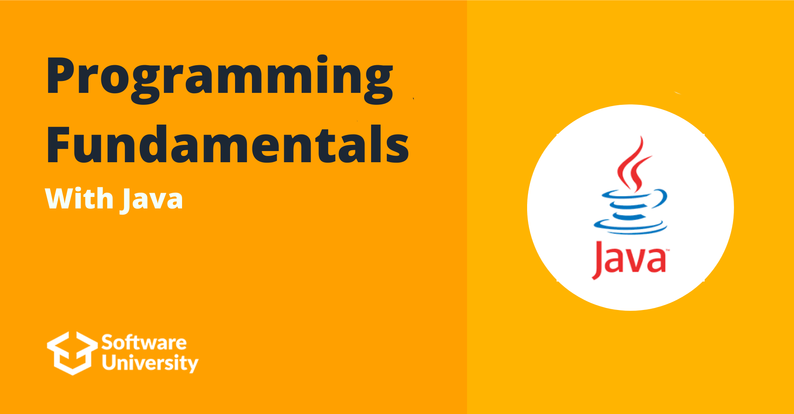

# Programming Fundamentals With Java September 2023

## Intro
Programming Fundamentals introduced me to the vast world of the IT industry. In this module I learned about HTTP, HTML, CSS, Git and GitHub, as well as what QA is. In the end of the course, we had the opportunity with the help of the lecturer to develop our first web project. During the course we learned more deeply about Data Structures such as Arrays, Lists and Associative Arrays. I learned to use methods, regular expressions and also for the first time I got acquainted with Object Oriented Programming.

To learn more about the course you can check [Softuni](https://softuni.bg/)

## Course topics

### Basic Syntax, Conditional Statements and Loops
- [Lab](https://github.com/Dimitar-Peev/02.PF-Java-September-2023/tree/main/_01_BasicSyntaxConditionalStatementsAndLoops/_01_Lab)
- [Exercise](https://github.com/Dimitar-Peev/02.PF-Java-September-2023/tree/main/_01_BasicSyntaxConditionalStatementsAndLoops/_02_Exercise)
- [More Exercise](https://github.com/Dimitar-Peev/02.PF-Java-September-2023/tree/main/_01_BasicSyntaxConditionalStatementsAndLoops/_03_MoreExercise)
### Data Types and Variables
- [Lab](https://github.com/Dimitar-Peev/02.PF-Java-September-2023/tree/main/_02_DataTypesAndVariables/_01_Lab)
- [Exercise](https://github.com/Dimitar-Peev/02.PF-Java-September-2023/tree/main/_02_DataTypesAndVariables/_02_Exercise)
- [More Exercise](https://github.com/Dimitar-Peev/02.PF-Java-September-2023/tree/main/_02_DataTypesAndVariables/_03_MoreExercise)
### HTML & CSS Basics 
- [Lab]
### Arrays
- [Lab](https://github.com/Dimitar-Peev/02.PF-Java-September-2023/tree/main/_03_Arrays/_01_Lab)
- [Exercise](https://github.com/Dimitar-Peev/02.PF-Java-September-2023/tree/main/_03_Arrays/_02_Exercise)
- [More Exercise](https://github.com/Dimitar-Peev/02.PF-Java-September-2023/tree/main/_03_Arrays/_03_MoreExercise)
### Methods
- [Lab](https://github.com/Dimitar-Peev/02.PF-Java-September-2023/tree/main/_04_Methods/_01_Lab)
- [Exercise](https://github.com/Dimitar-Peev/02.PF-Java-September-2023/tree/main/_04_Methods/_02_Exercise)
- [More Exercise](https://github.com/Dimitar-Peev/02.PF-Java-September-2023/tree/main/_04_Methods/_03_MoreExercise)
### Lists
- [Lab](https://github.com/Dimitar-Peev/02.PF-Java-September-2023/tree/main/_05_List/_01_Lab)
- [Exercise](https://github.com/Dimitar-Peev/02.PF-Java-September-2023/tree/main/_05_List/_02_Exercise)
- [More Exercise]
### Bitwise Operations
- [Lab]
### Objects and Classes
- [Lab](https://github.com/Dimitar-Peev/02.PF-Java-September-2023/tree/main/_08_ObjectsAndClasses/_01_Lab)
- [Exercise](https://github.com/Dimitar-Peev/02.PF-Java-September-2023/tree/main/_08_ObjectsAndClasses/_02_Exercise)
- [More Exercise](https://github.com/Dimitar-Peev/02.PF-Java-September-2023/tree/main/_08_ObjectsAndClasses/_03_MoreExercise)
### Associative Arrays
- [Lab](https://github.com/Dimitar-Peev/02.PF-Java-September-2023/tree/main/_09_AssociativeArrays/_01_Lab)
- [Exercise](https://github.com/Dimitar-Peev/02.PF-Java-September-2023/tree/main/_09_AssociativeArrays/_02_Exercise)
- [More Exercise]
### Text Processing
- [Lab](https://github.com/Dimitar-Peev/02.PF-Java-September-2023/tree/main/_10_TextProcessing/_01_Lab)
- [Exercise](https://github.com/Dimitar-Peev/02.PF-Java-September-2023/tree/main/_10_TextProcessing/_02_Exercise)
- [More Exercise](https://github.com/Dimitar-Peev/02.PF-Java-September-2023/tree/main/_10_TextProcessing/_03_MoreExercise)
### Regular Expressions
- [Lab](https://github.com/Dimitar-Peev/02.PF-Java-September-2023/tree/main/_11_RegularExpressions/_01_Lab)
- [Exercise](https://github.com/Dimitar-Peev/02.PF-Java-September-2023/tree/main/_11_RegularExpressions/_02_Exercise)
- [More Exercise](https://github.com/Dimitar-Peev/02.PF-Java-September-2023/tree/main/_11_RegularExpressions/_03_MoreExercise)

## Exams
- [01.Programming Fundamentals Mid Exam Retake](https://github.com/Dimitar-Peev/02.PF-Java-September-2023/tree/main/FundamentalsExams/_01_ProgrammingFundamentalsMidExamRetake)
- [01.Programming Fundamentals Final Exam Retake](https://github.com/Dimitar-Peev/02.PF-Java-September-2023/tree/main/FundamentalsExams/_01_ProgrammingFundamentalsFinalExamRetake)
- [02.Programming Fundamentals Mid Exam](https://github.com/Dimitar-Peev/02.PF-Java-September-2023/tree/main/FundamentalsExams/_02_ProgrammingFundamentalsMidExam)
- [02.Programming Fundamentals Final Exam](https://github.com/Dimitar-Peev/02.PF-Java-September-2023/tree/main/FundamentalsExams/_02_ProgrammingFundamentalsFinalExam)
- [03.Programming Fundamentals Mid Exam Retake](https://github.com/Dimitar-Peev/02.PF-Java-September-2023/tree/main/FundamentalsExams/_03_ProgrammingFundamentalsMidExamRetake)
- [03.Programming Fundamentals Final Exam Retake](https://github.com/Dimitar-Peev/02.PF-Java-September-2023/tree/main/FundamentalsExams/_03_ProgrammingFundamentalsFinalExamRetake)
- [04.Programming Fundamentals Mid Exam](https://github.com/Dimitar-Peev/02.PF-Java-September-2023/tree/main/FundamentalsExams/_04_ProgrammingFundamentalsMidExam)
- [04.Programming Fundamentals Final Exam](https://github.com/Dimitar-Peev/02.PF-Java-September-2023/tree/main/FundamentalsExams/_04_ProgrammingFundamentalsFinalExam)
- [05.Programming Fundamentals Mid Exam](https://github.com/Dimitar-Peev/02.PF-Java-September-2023/tree/main/FundamentalsExams/_05_ProgrammingFundamentalsMidExam)
- [05.Programming Fundamentals Final Exam](https://github.com/Dimitar-Peev/02.PF-Java-September-2023/tree/main/FundamentalsExams/_05_ProgrammingFundamentalsFinalExam)
- [06.Programming Fundamentals Mid Exam Retake](https://github.com/Dimitar-Peev/02.PF-Java-September-2023/tree/main/FundamentalsExams/_06_ProgrammingFundamentalsMidExamRetake)

## Certificates
[Programming Fundamentals Certificate](https://softuni.bg/certificates/details/195140/4b98aaf6)
